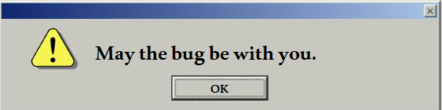

# Welcome to my GitHub 👋

## 🔧 Technologies & Tools

<!-- ## Github Stats  -->
<!-- <a href="https://github.com/kasettakorn"> -->
<!--    -->
<!-- </a> -->
<!-- <a href="https://github.com/kasettakorn"> -->
<!--   -->
<!-- </a> -->

## 📱 Contact me

<!--
**kasettakorn/kasettakorn** is a ✨ _special_ ✨ repository because its `README.md` (this file) appears on your GitHub profile.

Here are some ideas to get you started:

- 🔭 I’m currently working on ...
- 🌱 I’m currently learning ...
- 👯 I’m looking to collaborate on ...
- 🤔 I’m looking for help with ...
- 💬 Ask me about ...
- 📫 How to reach me: ...
- 😄 Pronouns: ...
- ⚡ Fun fact: ...
-->
